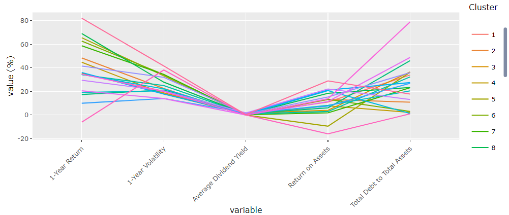

```{r setup, include=FALSE}
knitr::opts_chunk$set(echo = FALSE)
```

# Introduction

In 2020, the combination of unprecedented stock market volatility and COVID-19 lockdowns attracted herds of retail investors into the stock market. Major online brokers witnessed spikes in new account openings, showing that many new investors saw the market plunge as an opportune time to start investing.
  
  Most retail investors rely on traditional financial data websites such as Yahoo Finance to retrieve relevant financial data to aid in their investing decisions. However, these sites' offerings tend to be homogeneous and comprise usual information such as price quotes, market commentary and corporate actions. Investors are left on their own to make sense of these information, without tools to further perform actions such as price forecasting or segmenting stocks into groups. These tools could possibly enhance their investing decisions.
  
  Having identified this gap, we developed InVIZments, an interactive visual analytics application to allow investors to not only retrieve basic price information of stocks, but also apply machine learning models such as ARIMA forecasting and hierarchical clustering. 
  
# Motivation & Objectives
Our research was motivated by the lack of effective and easy to use web-enabled analytics tools for investment planning especially in heightened investment interest brought about by Covid-19. We aim to provide investors with an analytical tool that supports the following analysis requirements: 

1. To be able to conduct technical, portfolio analysis and correlation analysis amongst multiple stocks; 
2. To create a clustering visualization of related stocks so users can diversify their holdings; 
3. To provide a forecast of future stock prices for users to identify suitable entry/exit points.  
  
# Methods 

The whole application is built on R using a host of open source R packages. 

In terms of architecture: we have decided to design and develop InVIZments based on **R Shiny**. [Shiny](https://shiny.rstudio.com/articles/shiny-server.html) is an open source R package that provides an elegant and powerful web framework for building web applications using R. Shiny helps you turn your analyses into interactive web applications without requiring HTML, CSS, or JavaScript knowledge.The design of the Shiny server allows us to make the application available across the Internet (i.e. to the masses). This reduces the need for maintenance and infrastructure costs, thus allowing us to provide our application to a wider audience for FREE.

The other key packages used for modeling and visualizations are: **Tidyquant**, **timetk** , **Modeltime**, **dygraphs**, **dendextend**.

# Application optimisation and UX Choices

Some of the key features of the application were built with the following considerations in mind:

1. Functionality. To allow a variety of users to fulfil different investment objectives, be it a short-term trader, a long term investor, a user looking to compare portfolios, and more. In addition, a few other key design choices include: a) opting for interactive charts such as plotly and dygraphs, b) allowing users to download data tables (both current and all pages), c) taking a screenshot, etc.

2. User experience. Some key considerations include: a) Sequencing of sub-modules in the tabs, b) Using tabbed box for logically grouped objects, while reducing clutter, c) Relevant user feedback such as shinycssloader package (loading animation), shinydisconnect package (useful information in case of server disconnect), d) Adding a “getting started” landing page to allow users to quickly get familiarized, e) Compartmentalizing code into modules, allowing future users to better make sense of the inner makings of this complex app (code base in main app.R reduced from 1.8k lines to around 1k), f) Using reactivity for certain calculations, improving responsiveness and efficiency, etc.

3. Aesthetics. Some key considerations include: a) Using a dashboard layout, utilizing boxes and tabbed boxes to position objects logically, b) Updating the look and feel by changing the default dashboard theme, c) Adding various icons, and many other small quality of life tweaks around the app through experimentation and multiple iterations, etc.

# Results / Key Functions

One key feature from each sub-module of the application will be highlighted and due to space limitations.

**Charting and Technical Analysis**

Under the Portfolio Analysis tab, users are able to compare the performance of various portfolios (constructed using different weights) across time. Users are able to specify a starting equity amount, and visualize the equity curve over time.Users can tweak the weightage of the various stocks in the portfolio to achieve an equity curve that exhibits strong growth, but yet tolerable periods of drawdown(periods when the portfolio performance exhibits a downwards trend from most recent highs). Crucially, users will be able to construct up to 3 different portfolio weightages and compare their relative performances against each other. In the example below, portfolio 1 outperforms 2 and 3. 

```{r, fig.align="center", echo=FALSE, out.height = "300px"}
knitr::include_graphics("images/portfolio_analysis.PNG")
```

**Clustering**

In the clustering module, after the clustering process is completed. Users can view a line graph showing the characteristics of each cluster. For each cluster, the value seen on the line graph for each variable is the average value of that variable for all the stocks in the cluster. For example, if Cluster 19 has a value of -6% for 1-Year Return, it means that the average 1-Year Return for all the stocks in Cluster 19 is -6%. There is an interactivity option to isolate the view for a single cluster to strip out the noise from the other clusters. This allows users to pick clusters based on their preferences and to identify stocks that fits their risk profile.

```{r, fig.align="center", echo=FALSE, out.width = "675px", out.height = "300px"}

```

**Time Series Forecasting**

Users can use our application to forecast stock prices from 1 - 4 weeks ahead of present day. Orr ensemble forecast method generates forecasts from 5 models and takes in the results of the 3 top performing models based on the selected accuracy measure and drops the other 2 . The ensemble model calculates the mean of 3 models which were retained, which is then presented as the forecast of the application. This gives users a good idea of what the future price movements will be and how to time their movements. For example: Looking at the forecast for AAPL over the next week. The prices are expected to remain stable and hence it might be good for the users to wait before taking up a position. 

```{r, fig.align="center", echo=FALSE}
knitr::include_graphics("images/forecast.PNG")
```

# Next Steps

1. For the Charting sub-module, we can include a wider range of technical indicators for the investor to overlay on the candlestick charts. A backtesting module can also be incorporated to simulate trading performance based on technical analysis.

2. For the Time Series Forecasting sub-module, we can potentially include more choices of forecasting models which the investor may wish to explore. This will also allow for comparison of forecasts across models.

3. For the clustering sub-module, explore incorporating a wider range of financial variables to cluster upon. The financial variables data used in this sub-module was manually pulled from Bloomberg as there is no current R package that allows for the pulling of historical financial variables. Work can be done to pull data from a wider range of both financial variables as well as stocks, so that investors can do cluster analysis on more classes of stocks other than technology stocks, and also on more financial variables than is currently available on our application.

# Conclusion

This application was targeted at investors to provide useful tools to aid them in their investing process that traditional sources do not provide. While every possible care and effort has been taken to make the application as accurate as possible. The application is meant as decision support and users are advised to exercise due diligence on their part when investing. InVIZments shall not in any event be liable for any damages or injury arising out of your access to, or inability to access the application or from your reliance on any information provided within it. 
