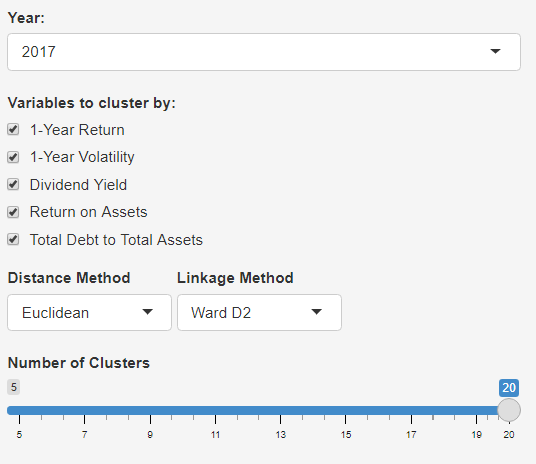
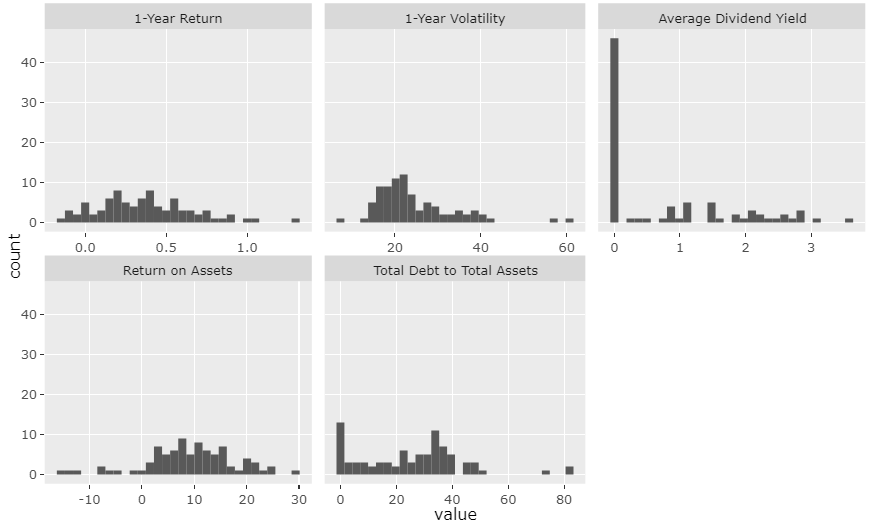
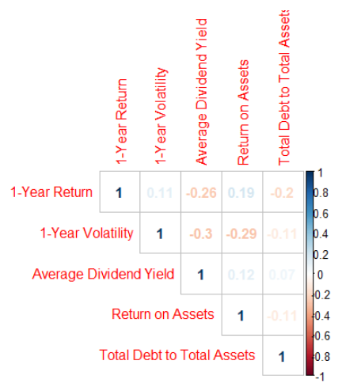
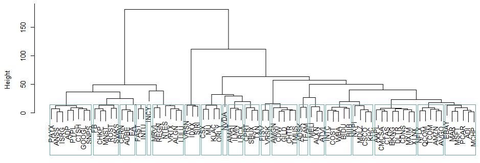
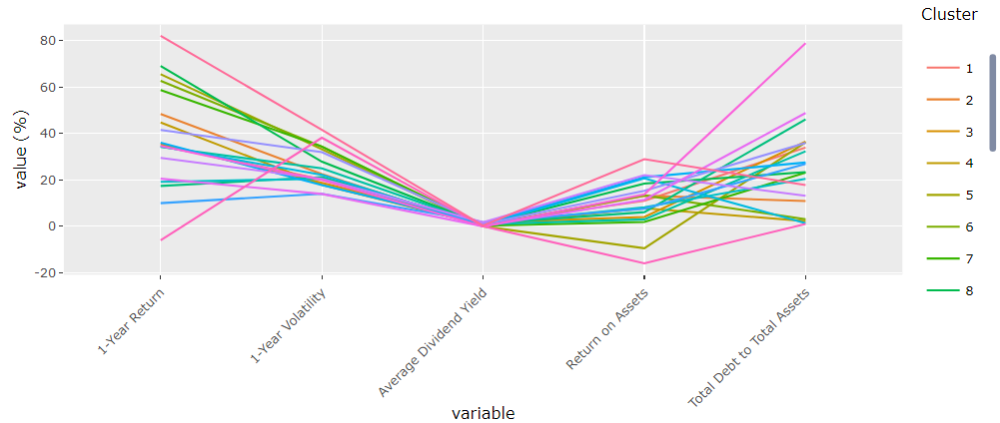
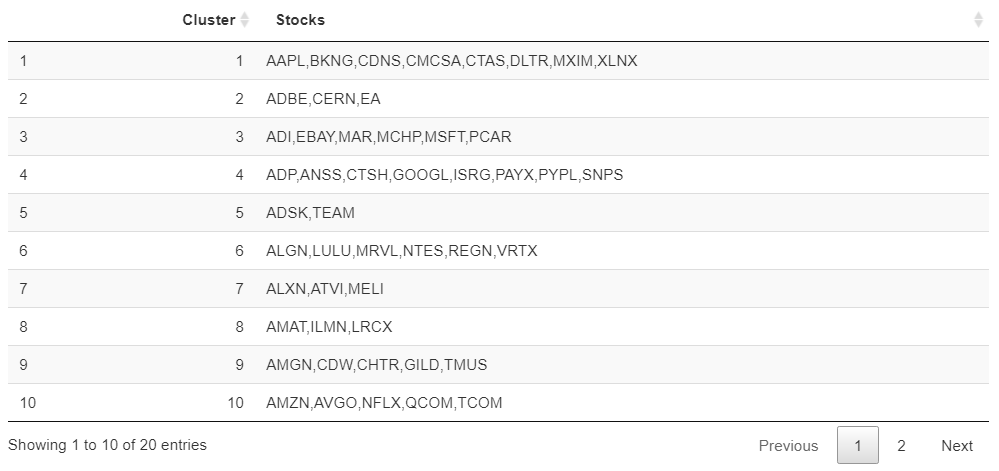
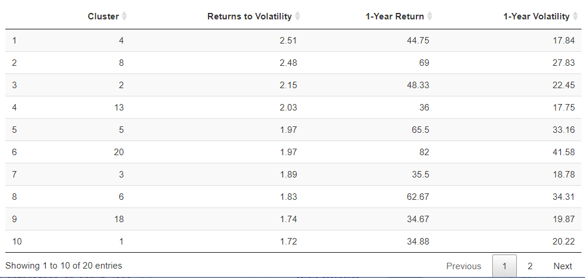

---
title: Investing101
author:
  - name: Andre Lee
    email: andre.lee.2019@mitb.smu.edu.sg
    affiliation: Singapore Management University
  - name: Boey Yi Heen
    email: yiheen.boey.2019@mitb.smu.edu.sg
    affiliation: Singapore Management University
  - name: Ng Wee Kien
    email: weekien.ng.2020@mitb.smu.edu.sg
    affiliation: Singapore Management University
abstract: |

  In making investing decisions, it is always helpful to have seamless tools at investors' disposal to generate insights out of the deluge of financial data available out there. In this project, we developed an R Shiny application using a range of data visualisation techniques to provide some useful tools to investors to aid them in their investing decisions. These tools are not available in traditional sources which retail investors tend to use. The embedded models, visualisation tools and application design of the application are discussed.
  

  
bibliography: sigproc.bib
csl: acm-sig-proceedings.csl
output: rticles::acm_article
---

```{r echo=FALSE, include=FALSE}
library(magrittr)
library(dplyr)
library(knitr)
library(kableExtra)
```

# Introduction 
Most retail investors rely on traditional financial data websites such as Yahoo Finance to retrieve relevant financial data to aid in their investing decisions. However, these sites' offerings tend to be homogeneous and comprise usual information such as price quotes, market commentary and corporate actions. Investors are left on their own to make sense of these information, without tools to further perform actions such as price forecasting or segmenting stocks into groups. These tools could possibly enhance their investing decisions.
  
Having identified this gap, we developed Investing101, an interactive visual analytics dashboard to allow investors to not only retrieve basic price information of stocks, but also apply machine learning models such as ARIMA forecasting and hierarchical clustering. The dashboard will also allow users to construct bespoke portfolios and see their historical performances. On top of this, the dashboard also provides users with a tool that readily aggregates and interprets candlestick patterns for the user. All these different tools come together to deliver a product that adds value to investors, on top of what traditional finance data websites can provide.

# Motivation & Objectives

# Literature Review

## Technical Indicators

In the literature review conducted, it was found that there have been various attempts by users to provide tools for analysing stock price action. Existing charting or dashboarding tools often focus on only simple charting or technical indicator functionalities. Most open source/ free tools only offer the various functionalities in isolation, and users are unable to have a holistic view uniting technical analysis, portfolio analysis, and the other components to allow for complete decision making when making buying and selling decisions.

In this sub-module, the team will put together various sub-modules spanning across: Charting, Technical Analysis, Correlation Analysis, Clustering, Forecasting, Portfolio Analysis.

## Forecasting

Time series forecasting is not the same as technical analysis and can be seen as a natural extension/logical next step after conducting technical analysis. The main difference is that time series forecasting gives you an exact forecasted price, while technical analysis only predicts the future movement (up/down) of the price (Berdiell, 2015) [@berdiell]. The fundamental idea of this method is to seek out patterns in the historical stock prices with a hybrid approach. A hybrid approach combine multiple different models to forecast stock prices. For example, the papers of Markowska-Kaczmar and Dziedzic (2008) [@dzied]  and Wang et al (2015) [@wang] both proposed tackling stock price forecasting with an amalgamation of multiple models instead of just relying on one form of forecasting. This has been shown to result in superior forecasting accuracy and performance as compared to using a dedicated forecasting method. The researches of Dey et al. (2016) [@dey] has also shown similar results albeit with some overfitting issues and a limited testing scenario.

The modification made in building the sub-module to the existing hybrid techniques is that the application will do a forecast based on 5 different models then present the mean of the 3 best performing ones. 

## Clustering

Da Silva, Cunha, and da Costa (2005) [@sergio] carried out hierarchical clustering on 816 stocks listed in North and South America from 1997-1999 on the following variables: return, risk, earnings-price ratio, book value-price ratio, sales-price ratio, sales-number of stocks ratio and dividend yield. Their research showed that clusters with the best risk-return profile from the time window where clustering was conducted continued to be so in a second time window from 2000-2001. However, their research did not comprise visualisations of the cluster characteristics. In addition, their research only showed results for one fixed combination of variables. Lastly, there was no insight as to how the winning clusters performed against a benchmark index, which is potentially of interest.

This research provides opportunities to address the limitations of existing literature as described above. The team looks to incorporate interactivity features and appropriate visualisations into the sub-module as part of improving on existing work.


# The Application

## System Design & Architecture

After careful consideration and specially taking into account the need to bring financial literacy to the masses we have decided to design and develop Investing101 based on R Shiny. [Shiny](https://shiny.rstudio.com/articles/shiny-server.html) is an open source R package that provides an elegant and powerful web framework for building web applications using R. Shiny helps you turn your analyses into interactive web applications without requiring HTML, CSS, or JavaScript knowledge.

The design of the Shiny server allows us to make the application available across the Internet (i.e. to the masses). The Shiny Server will host each app at its own web address and automatically start the app when a user visits the address. When the user leaves, Shiny Server will automatically stop the app. This reduces the need for maintenance and infrastructure costs, thus allowing us to provide our application to a wider audience for FREE.

## Visualizations

The data visualisations within the application are built using a host of open source R packages. They are 'tmap', 'tidyverse', 'forecast', 'tseries', 'readxl', 'tidyquant', 'dygraphs', 'TSstudio', 'plotly', 'tsibble', 'ggplot2', 'tidymodels', 'modeltime', modeltime.ensemble', 'timetk', 'glmnet', 'randomForest', 'shiny', 'readr', 'DT', 'shinydashboard', 'CandleStickPattern', 'ggpubr', 'dplyr','cluster', 'formattable', 'reshape2', 'zoo', 'tibble', 'ggdendro', 'knitr','kableExtra', 'dendextend', 'scales', 'data.table','corrplot', 'factoextra'. 

The following packages are discussed in detail as they are integral to the workings and logic of the application.

The **Tidyquant** package integrates the most useful functions from the xts, zoo, quantmod, TTR, and PerformanceAnalytics packages. It is also one of the key sources of data for our application.

The **timetk** package is part of the modeltime ecosystem for time series analysis and forecasting. The forecasting system is extensive and includes many ready made algorithms, allowing for ensembling and resampling, Machine Learning and Deep Learning. It is mainly used to calculate and analysis financial ratios and also the plotting of time series/financial data.

The **dygraphs** package is able to handle huge data sets.It also creates interactive plots out of the box, allowing the user to use our app more interactively. dygraphs is also Highly customizable and works in most browsers and mobile devices which once again allows us to deliver our app to the masses. **plotly** is another package that we use for creating interactive web graphics via the open source JavaScript graphing library plotly.js which allows use to create customizable intractive plots used for visualization in our application.

**Modeltime** unlocks time series models and machine learning in one framework meaning that is no need to switch back and forth between various frameworks. Modeltime incorporates a streamlined workflow for using best practices to forecast. Its many different algorithm and models means that the application can be easily scaled up to include more forecasting models with little effort. 

**dendextend** package allows many functions for manipulating and visualizing dendrograms. In the case of hierarchical clustering, it allows for visualizing and comparing trees and adjusting a tree's graphical parameters, such as colour, size, type etc of its branches.


## Charting

### Charting and Technical Analysis

In this module, users are able to visualize the chosen stock symbol using a candlestick chart. Open, High, Low, and Close prices for the selected period are shown on the chart.

In addition, users are able to choose between 2 sets of technical indicators: Simple moving averages and Bollinger Bands. Users are able to see the chosen symbol on 1 chart, and the accompanying benchmark index chosen on another chart. Both charts are created in an interactive manner using the plotly package.

Finally, multiple features based on candlestick patterns are created and available through a table. Such candlestick patterns inform users of certain bullish or bearish price action patterns observed. This provides a different perspectives to users incline towards technical analysis.

### Correlation Analysis
In this sub section, users are able to:
- Choose 4 stock symbols and visualize their monthly adjusted prices
  Visualize any anomalous points for these 4 stock symbols using an interactive chart
- Visualize the 6 month rolling correlation between the 4 stock symbols, and the accompanying benchmark index


### Portfolio Analysis
In this sub section, users are able to:
- Create 3 portfolios with different weightages for the 4 chosen stock symbols plus the accompanying benchmark index
- Visualize the monthly returns (in %) for the 3 different portfolios on an interactive plot
- Visualize an equity curve of the 3 portfolios, where users are able to choose the starting equity amount

## Time Series Forecasting

This sub-module of the dashboard is a tool to carry out time series forecasting on a stock. For this sub-module, forecasting will be carried out on a chosen ticker. The intent for this sub-module is to allow the user to identify future trends of a stock and entry/exit opportunities. The example given will be based on the technology company *APPLE (AAPL)*.


### Data Preparation

The sole data source for this sub-module is the tidyquant package on R.

We use the tidyquant package to pull historical prices of the stocks. The extracted data is then broken down into training and testing sets to build the forecasting model. The dashboard is reactive and will be able to pull any stock ticker chosen by the user as long as it is available through Tidyquant. 

### Model building

A few models are used and built in this edition of the application. 

1. ARIMA

ARIMA, short for ‘Auto Regressive Integrated Moving Average’ is a model that describes a given time series based on its own past values with its own lags and the lagged forecast errors, so that those lags and delay correlations can be plugged into the ARIMA equation to forecast future values.

An ARIMA model is characterized by 3 terms: p, d, q

where,

p is the order of the AR term - We can determine the required number of AR terms by inspecting the Partial Autocorrelation (PACF) plots. PACF can be described as the correlation between the series and its lag, after excluding the contributions from the intermediate lags.

q is the order of the MA term - The ACF tells how many MA terms are required to remove any autocorrelation in the stationarized series.

d is the number of differencing required to make the time series stationary

2. Prophet

3. GLMNet

4. Random Forest

5. Prophet XG Boost


## Clustering

The next sub-module of the dashboard is a tool to carry out hierarchical clustering on stocks. For this sub-module, clustering analysis will be carried out on 89 current component stocks of the NASDAQ-100 Index. The Nasdaq-100 Index is a basket of the 100 largest non-financial companies listed on the Nasdaq Exchange in the US. Companies listed in the Nasdaq-100 Index largely belong to the technology sector, and some household names include Apple, Google, Tesla and Facebook. COVID-19 accelerated the rise of the digital economy and drove digital transformation initiatives in companies around the world; it also proved to be a boon for technology industries such as cloud computing, videoconferencing and cybersecurity. There has been huge investor interest in technology stocks following their outperformance in 2020 and the ongoing hype of digitisation. Many rookie investors have also entered the fray, hoping to be involved in these companies’ growth. We choose to focus on stocks in the NASDAQ-100 Index for this sub-module to provide users with a tool to aid their decisions in investing in the biggest US-listed technology stocks.

### Clustering variables

For this sub-module, hierarchical clustering will be carried out on 5 variables which have been selected to cover a holistic range of financial indicators of a company. The time horizon for a clustering is one year. The 5 variables are as follows: "1-Year Return","1-Year Volatility","Dividend Yield","Return on Assets","Total Debt to Total Assets".


### Data Preparation

There are 2 main data sources for this sub-module: 1) Bloomberg Terminal 2) tidyquant package on R

The Bloomberg Terminal is used to pull the historical yearly financial ratios and volatility for the stocks. Bloomberg nicely stores these data points which can be easily pulled into csv format. For each stock in our stock universe, yearly historical values from 2015-2020 are pulled for the variables as mentioned above.

We use tidyquant package solely to pull historical prices of the stocks, which we then convert to yearly returns. The reason we use tidyquant rather than using Bloomberg is because tidyquant package has functions which can help us automatically calculate returns for different periodicities, such as annual or monthly. In this context, we look at yearly returns from 2015-2020 for the stocks in our stock universe.


# Case Study
## Technical Indicators
## Clustering

We demonstrate how to use the Clustering Analysis sub-module of our dashboard by carrying out a round of clustering analysis on a combination of selectable variables.

On the side panel of the dashboard, interactivity features are available to allow the user to select the following: "Year", "Variables to cluster by:", "Distance Method", "Linkage Method" and "Number of Clusters".


```{r echo=FALSE, out.width = "240px", out.height = "240px"}

```

For this case study, we carry out clustering in 2017 on all 5 variables. We select Euclidean to be the distance measure to compute the distance matrix, and Ward D2 as the agglomeration method for the hierarchical clustering algorithm. The resulting dendrogram is cut into 20 clusters.


### Pre-Clustering: Univariate and Correlation Analysis

Users will be able to visualise the distribution of the clustering variables they selected for the selected year.



Before clustering, it is essential to check for multicollinearity. If there is a high degree of collinearity between variables, they will not be sufficiently unique to identify distinct clusters. In addition, if highly correlated variables are used for cluster analysis, the aspects covered by these variables will be given excess weightage in the clustering output. We see from the following correlation plot that multicollinearity is not an issue.




### Clustering Results

The main panel of the dashboard has 4 main outputs. At the top of the panel is the dendrogram showing how the stocks have been cut into clusters, in this case 20 clusters.



Below the dendrogram is a line graph showing the combination of variable values for each cluster. For each cluster, the value seen on the line graph for each variable is the average value of that variable for all the stocks in the cluster. For example, if Cluster 19 has a value of -6% for 1-Year Return, it means that the average 1-Year Return for all the stocks in Cluster 19 is -6%. There is an interactivity option to isolate the view for a single cluster to strip out the noise from the other clusters.



Next, the user will be able to see the breakdown of each cluster's constituent stocks in a table. For example, we see from the table below for our case study that Cluster 4 consists of the stocks ADP, ANSS, CTSH, GOOGL, ISRG, PAYX, PYPL and SNPS.




The final output on the main panel is each individual cluster's return and volatility profile. An additional panel calculating the Returns to Volatility ratio is included, arranged in descending order. This way, users can see instantly which cluster performed the best in terms of risk-adjusted returns for that year. We see that Cluster 4 performed the best in 2017.



### Clustering Results - Backtesting

We then explore a use case as to how to use the clustering results to aid in investing decisions. Following from the finding that Cluster 4 stocks performed the best in 2017, the user may want to use this to explore if outperformance of a cluster continues into the next year 2018. This is an example of momentum investing, a strategy that aims to capitalize on the continuance of existing trends.

Using the sub-module (Weekien), we construct a portfolio consisting of......compare against XLK benchmark....outperform!

## Forecasting


# Conclusion and Future Work

This paper set out the development of a web application targeted at investors to provide useful tools to aid them in their investing process that traditional sources do not provide. This was motivated by the heightened interest in investing following the market volatility which was brought about by COVID-19. 

The application was developed using the Shiny architecture on R, with an emphasis on the usage of interactivity features and data visualisations to allow users to derive insights from financial data. Going forward, we have the following ideas to further improve and expand the scope of the application:

1. For the Charting sub-module, we can include a wider range of technical indicators for the investor to overlay on the candlestick charts. A backtesting module can also be incorporated to simulate trading performance based on technical analysis.

2. For the Time Series Forecasting sub-module, we can potentially include more choices of forecasting models which the investor may wish to explore. This will also allow for comparison of forecasts across models.

3. For the clustering sub-module, explore incorporating a wider range of financial variables to cluster upon. The financial variables data used in this sub-module was manually pulled from Bloomberg as there is no current R package that allows for the pulling of historical financial variables. Work can be done to pull data from a wider range of both financial variables as well as stocks, so that investors can do cluster analysis on more classes of stocks other than technology stocks, and also on more financial variables than is currently available on our application.
 

\newpage

\newpage

# Tables

```{r echo=FALSE}

df <- data.frame(financial_ratio = c("1-Year Return","1-Year Volatility","Dividend Yield","Return on Assets","Total Debt to Total Assets"), 
                 definition = (c("Return on an investment generated over a year and calculated as a percentage of the initial amount of investment.", 
                                 "Statistical measure of the rate of fluctuations in the price of a security over 1 year. Volatility is also known as standard deviation.",
                                 "Shows how much a company pays out in dividends each year relative to its stock price, expressed as a percentage.",
                                 "A type of return on investment (ROI) metric that measures the profitability of a business in relation to its total assets. The higher the return, the more productive and efficient management is in utilizing economic resources",
                 "A leverage ratio that indicates the percentage of assets that are being financed with debt. The higher the ratio, the greater the degree of leverage and financial risk")), 
    Financial_Aspect = (c("Financial Return","Market Volatility","Payout to Shareholders" ,"Profitability","Leverage")))

kbl(df , col.names = c("Financial Ratio", "Definition", "Financial Aspect"), escape = F,booktabs = T , "latex") %>%
  
  column_spec(2, width = "10cm")
```


# References


