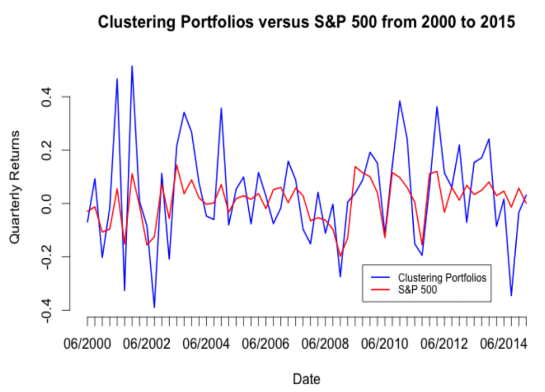
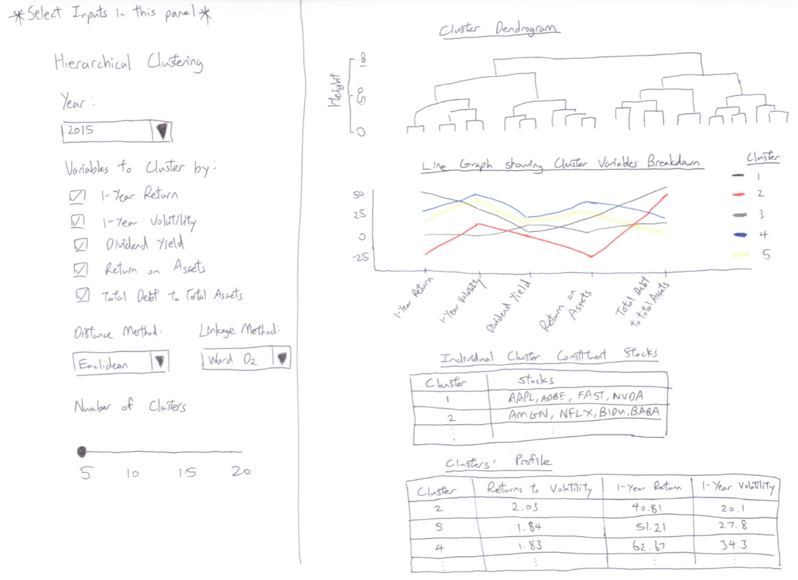

```{r setup, include=FALSE}
knitr::opts_chunk$set(echo = FALSE)
```

```{r}
#Load packages
packages = c("tidyquant","tidyverse","ggpubr","ggplot2","dplyr","cluster","formattable","reshape2","zoo","tibble","ggdendro","knitr","kableExtra","dendextend","plotly","scales","data.table","corrplot")
for (p in packages){
  if(!require(p,character.only = T)){
    install.packages(p)
  }
  library(p,character.only = T)
  
}
```

## 1. Overview

### 1.1. Background

The Nasdaq-100 Index is a basket of the 100 largest non-financial companies listed on the Nasdaq Exchange. Companies listed in the Nasdaq-100 Index largely belong to the technology sector, and some household names include Apple, Google, Tesla and Facebook. 

The performance of the Nasdaq-100 Index is largely seen as a barometer as to how well the technology sector is performing. COVID-19 accelerated the rise of the digital economy and drove digital transformation initiatives in companies around the world; it also proved to be a boon for technology industries such as cloud computing, videoconferencing and cybersecurity. Many stocks in these industries experienced massive gains in 2020.

There has been huge investor interest in technology stocks following their outperformance in 2020 and the ongoing hype of digitisation. Many rookie investors have also entered the fray, hoping to be involved in these companies' growth.


### 1.2. Objective and Motivation

This sub-module aims to aid rookie investors in picking technology-centric stocks for their portfolios through a method that is seldom made available to retail investors - clustering.


### 1.3. Hierarchical Clustering

Cluster Analysis is an unsupervised learning technique for separating subjects into clusters, based on combinations of input variables, so that each subject is more similar to other subjects in its cluster than to subjects outside the cluster. Each cluster thus describes, in terms of the data collected, the class to which its members belong.

Hierarchical clustering is a clustering method that, as the name suggests, builds hierarchy of clusters. The algorithm starts with all the data points assigned to a cluster of their own. A distance similarity measure is applied to merge two nearest clusters into the same cluster. This continues until there is only one single cluster left. A dendogram can then be used to show the hierarchy of clusters.

For this sub-module, hierarchical clustering will be carried out on 5 variables which have been selected to cover a holistic range of financial indicators of a company. The time horizon for a clustering is one year. The 5 variables are as follows:


```{r}
df <- data.frame(financial_ratio = c("1-Year Return","1-Year Volatility","Dividend Yield","Return on Assets","Total Debt to Total Assets"), 
                 definition = (c("Return on an investment generated over a year and calculated as a percentage of the initial amount of investment.", 
                                 "Statistical measure of the rate of fluctuations in the price of a security over 1 year. Volatility is also known as standard deviation.",
                                 "Shows how much a company pays out in dividends each year relative to its stock price, expressed as a percentage.",
                                 "A type of return on investment (ROI) metric that measures the profitability of a business in relation to its total assets. The higher the return, the more productive and efficient management is in utilizing economic resources",
                 "A leverage ratio that indicates the percentage of assets that are being financed with debt. The higher the ratio, the greater the degree of leverage and financial risk")), 
    Financial_Aspect = (c("Financial Return","Market volatility","Payout to Shareholders" ,"Profitability","Leverage")))

kable(df, col.names = c("Financial Ratio", "Definition", "Financial Aspect"), escape = F) %>%
  kable_styling(latex_options = "hold_position") %>%
  column_spec(1, bold = T, width = "20cm") %>%
   column_spec(2, width = "30cm") %>%
  column_spec(3, width = "13cm") %>%
  row_spec(0, align = "c", background = "gray")
```

## 2. Literature Review

Studies using cluster analysis to aid stock selection strategies have been done in the past. Da Silva, Cunha, and da Costa (2005) carried out hierarchical clustering on 816 stocks listed in North and South America from 1997-1999 on the following variables: return, risk, earnings-price ratio, book value-price ratio, sales-price ratio, sales-number of stocks ratio and dividend yield. 

However, there is lack of interactivity options for would-be users to choose the time period and the combination of variables they wish to carry out the clustering on. In addition, the study has no visual aid for users to visualise the differing characteristics across clusters. It is difficult to visualise cluster characteristics using the table output below from their study.


Marvin (2015) conducted k-means clustering on 668 stocks traded on the NYSE and NASDAQ from 2000 to 2015, on a weighted average of two ratios: revenue/assets and net income/assets. A diversified portfolio was then constructed by taking the stock with highest Sharpe ratio from each cluster and contrasting the performance versus S&P 500 as shown below:



While the visual comparison of performance against S&P 500 is useful, the study does not provide visual representation of the individual clusters. As a result, readers are unaware what the portfolio even consists of. Secondly, clustering purely on profitability metrics may be restrictive as it only covers one aspect of financial performance. Thirdly, there is no interactivity option to select the time period for clustering and performance evaluation. This feature would be useful since users might be interested to assess performance across different time periods.

In view of the limitations of existing Cluster Analysis studies on stocks, we construct this sub-module to incorporate useful interactivity features and visual analytics techniques to optimise its effectiveness for users.

## 3. Building the Visualization

### 3.1. Installing/Loading Required Libraries

The following code checks if the relevant packages used in this sub-module are installed, and if not, will proceed to install it. The libraries are then loaded.

```{r echo=TRUE,eval=FALSE}
#Load packages
packages = c("tidyquant","tidyverse","ggpubr","ggplot2","dplyr","cluster"
             ,"formattable","reshape2","zoo","tibble","ggdendro","knitr"
             ,"kableExtra","dendextend","plotly","scales","data.table")
for (p in packages){
  if(!require(p,character.only = T)){
    install.packages(p)
  }
  library(p,character.only = T)
  
}
```
### 3.2. Data Preparation

The features of the data used in this sub-module is as follows:

```{r}
df <- data.frame(element= c("Stock Universe","Time Period","Variables"), 
                 description = c("Current 89 component stocks of NASDAQ-100 Index. Only 89 component stocks are used instead of 100 because the other component stocks have incomplete data for at least one of the variables which we are interested to cluster the stocks by.",
                 "2015 to 2020",
                 "1-Year Return, 1-Year Volatility, Dividend Yield, Return on Assets, Total Debt to Total Assets") )

kable(df, col.names = c("Element", "Description"), escape = F) %>%
  kable_styling(latex_options = "hold_position") %>%
  column_spec(1, bold = T) %>%
   column_spec(2, width = "30cm") %>%

  row_spec(0, align = "c", background = "gray")
```


There are 2 main data sources for this sub-module: 
1) Bloomberg Terminal
2) tidyquant package on R


```{r}
df <- data.frame(datasource = c("Bloomberg Terminal","tidyquant package"), 
                 purpose = c("Pull historical financial ratios and volatility for the stocks",
                 "Pull historical prices for the stocks and use package functions to calculate annual returns"))

kable(df, col.names = c("Data Source", "Purpose"), escape = F) %>%
  kable_styling(latex_options = "hold_position") %>%
  column_spec(1, bold = T) %>%
   column_spec(2, width = "30cm") %>%
  
  row_spec(0, align = "c", background = "gray")
```

The Bloomberg Terminal is used to pull the historical yearly financial ratios and volatility for the stocks. Bloomberg nicely stores these data points which can be easily pulled into csv format. For each stock in our stock universe, yearly historical values from 2015-2020 are pulled for the variables as mentioned above: 'Dividend Yield', 'Return on Assets', 'Total Debt to Assets', '1-Year Volatility'. The resultant dataframe is shown below: 

```{r eval=TRUE, echo=TRUE, code.cap = "Read dataset pulled from Bloomberg, create Year column"}
library(rmarkdown)
bloomberg_data <- read_csv("nasdaq_ratios.csv") %>%
  mutate(across(where(is.numeric), round, 2))

#convert to date format
bloomberg_data$Date <- as.Date(bloomberg_data$Date, format="%d/%m/%y") 
#Make a Year column
bloomberg_data$Year <- format(bloomberg_data$Date, format="%Y") 
#Make Year into numeric form
bloomberg_data$Year <- as.numeric(bloomberg_data$Year) 

paged_table(bloomberg_data)
```
<center>**Table 1 (bloomberg_data): Data from Bloomberg**</center><br/>


We use tidyquant package solely to pull historical prices of the stocks, which we then convert to yearly returns. The reason we use tidyquant rather than using Bloomberg is because tidyquant package has functions which can help us automatically calculate returns for different periodicities, such as annual or monthly. In this context, we look at yearly returns from 2015-2020 for the stocks in our stock universe.

```{r eval=TRUE, echo=TRUE, fig.cap = "Use tidyquant to pull stock prices for NASDAQ-100 Index Constituents from 2015"}
 #Get Stock Prices from 2015
Stocks <- 
  tq_get(c("AAPL",  "ADBE",  "ADI"  , "ADP" ,  "ADSK" , "ALGN" , "ALXN",  "AMAT",  "AMD" ,  "AMGN" , "AMZN",  "ANSS" , "ATVI" , "AVGO"  ,"BIDU" , "BIIB",  "BKNG" , "CDNS" , "CDW" ,  "CERN" , "CHKP",  "CHTR",  "CMCSA","COST" , "CPRT" , "CSCO" , "CSX" ,  "CTAS" , "CTSH",  "DLTR", "DXCM" , "EA",    "EBAY" , "EXC" ,  "FAST","FB",  "FISV" , "FOXA",  "GILD",  "GOOGL", "IDXX" , "ILMN", "INCY" , "INTC" , "INTU",  "ISRG" , "JD" ,   "KHC" , "KLAC" ,"LRCX" , "LULU",  "MAR" ,  "MCHP",  "MDLZ",  "MELI" , "MNST"  ,"MRVL"  ,"MSFT" , "MU"  ,  "MXIM" , "NFLX" , "NTES",  "NVDA" , "NXPI" , "ORLY" , "PAYX" , "PCAR" , "PEP" ,  "PYPL"  ,"QCOM",  "REGN" , "ROST" , "SBUX" , "SGEN",  "SIRI" , "SNPS" , "SWKS" , "TCOM",  "TEAM" , "TMUS" , "TSLA" , "TXN"  , "VRSK", "VRSN",
 "VRTX" , "WBA"  , "XEL" ,  "XLNX" , "ZM" ), 
 get = "stock.prices", from = "2015-01-01") %>%
  group_by(symbol)

#Turn Prices into Yearly Returns
returns_yearly <- 
  Stocks %>%
    tq_transmute(select = adjusted, mutate_fun = periodReturn, period = "yearly")  

returns_yearly$Year <- format(returns_yearly$date, format="%Y") %>%
  as.numeric(returns_yearly$Year)

returns_yearly_final <- returns_yearly  %>% 
  
  select('symbol','yearly.returns','Year') %>% #select columns
  rename('Ticker' = 'symbol',
         '1-Year Return' = 'yearly.returns') %>%
  mutate(across(where(is.numeric), round, 2))

paged_table(returns_yearly_final)
```
<center>**Table 2 (returns_yearly): Data from tidyquant**</center><br/>

After pulling the required data from Bloomberg and tidyquant, we end up with 2 tibbles: bloomberg_data (from Bloomberg) and returns_yearly (from tidyquant). We then join them into one single tibble by inner joining on the columns 'Ticker' and 'Year'. This gives a single tibble containing the past 5 years' historical data, made up of the 5 variables we will be conducting clustering on, for the 89 Nasdaq-100 stocks.

In this example, we do the clustering on the year 2017, on the 5 variables '1-Year Return','1-Year Volatility','Average Dividend Yield','Return on Assets' and 'Total Debt to Total Assets'. The following table shows all the stocks' values for the variables in 2017:

```{r echo=TRUE}
combine <- dplyr::inner_join(bloomberg_data, returns_yearly_final, by =c("Ticker"="Ticker","Year"="Year"))

#Select the year and the variables columns for the final dataframe to undergo clustering
select_yearfilter <- combine %>%
  filter(Year == 2017) %>% #select the year
  select('Ticker','1-Year Return','1-Year Volatility','Average Dividend Yield','Return on Assets','Total Debt to Total Assets') %>% #select the variables to cluster
  #column_to_rownames('Ticker') %>% #make the Ticker column become rownames 
  mutate(across(where(is.numeric), round, 2))

paged_table(select_yearfilter)
```
<center>**Table 3 (combine): Combined data from Bloomberg and tidyquant, for the year 2017**</center><br/>


```{r ECHO=FALSE}
select_yearfilter <- select_yearfilter %>%
  column_to_rownames('Ticker') #make the Ticker column become rownames 

```


```{r}
# select_yearfilter
M <- cor(select_yearfilter)
corrplot(M, method ="number", type = "upper")
```


### 3.3. Visualisation of Results

Once we have selected the year and the variables, we proceed with the actual hierarchical clustering. 

Cluster analysis uses the concept of proximity matrix as measures of similarity and dissimilarity between the different data points. As the data is in continuous form, the Euclidean distance was used for computing the proximity using the dist function. The linkage method used here is “Ward.D2”. 


```{r echo=TRUE}

clust_dist <- dist(select_yearfilter,method = "euclidean")
clust <- hclust(clust_dist , method = "ward.D2")
```

We then plot the dendrogram, with the user able to choose how many clusters to cut the dendrogram into, with the clusters being clearly outlined in red dotted lines. In this case, user specifies to cut into k=20 clusters.

```{r eval=FALSE, fig.height=20}
plot(clust)
rect.hclust(clust, k=20, border = "cadetblue") #choose to cut into 20 clusters
# groups<- cutree(clust,k=20)
# abline(h=3, col = 'red')

```

```{r fig.height=20, echo=TRUE}
clust_dend <- as.dendrogram(clust)
plot(clust_dend, horiz = TRUE)
rect.dendrogram(clust_dend, k=20, horiz = TRUE, border = "red", lty = 5, lwd = 2)
```
<center>**Fig 1: Dendrogram cut into 20 clusters**</center><br/>

We can visualise on the line graph below each cluster's characteristics (average value) for each variable. plotly interactivity has been added so that individual clusters can be isolated by double-clicking on the cluster in the legend:

```{r echo=TRUE, fig.width=15, fig.height=10,out.width='130%',out.height='100%'}
#Get breakdown of stocks in each cluster
groups<- data.frame(cutree(clust, k =20))

#Merge the stocks with the variables
cluster_breakdown <- merge(groups,select_yearfilter, by = 0, all = TRUE)

cluster_breakdown <- subset(cluster_breakdown, select = -Row.names) 
  
colnames(cluster_breakdown)[1] <- "Cluster"

#Get average values of each variable for each cluster
final_cluster_breakdown <- cluster_breakdown %>%
  group_by(Cluster) %>%
  summarise(across(everything(),mean))

#Multiply 1-Year Return by 100 to make it in same scale as other variables
final_cluster_breakdown$`1-Year Return`<- final_cluster_breakdown$`1-Year Return` * 100

final_cluster_breakdown_melt <- melt(final_cluster_breakdown,id = "Cluster")

#Plot line graph
p <- ggplot(data = final_cluster_breakdown_melt) +
  geom_line(aes(x=variable, y = value, colour = as.factor(Cluster), group = Cluster)) +
  labs(colour="Cluster" , y= "value (%)") +
  theme(axis.text.x  = element_text(angle=45, hjust = 1))

#Give plotly interactivity to graph
fig <- ggplotly(p)

fig
```

```{r eval=FALSE}
p <- ggplot(data = final_cluster_breakdown_melt) +
  geom_line(aes(x=variable, y = value, colour = as.factor(Cluster), group = Cluster)) +
  labs(colour="Cluster" , y= "value (%)") +
  theme(axis.text.x  = element_text(angle=45, hjust = 1))

fig <- ggplotly(p)

fig
```
<center>**Fig 2: Line Graph showing Average Variable Value for each Cluster**</center><br/>

## 4. Making use of Clustering Output

Following the Hierarchical Clustering, we explore a use case for the output. First, we get the average Return and Volatility for all the stocks in each cluster for the year which we filtered by. A Return/Volatility ratio, also known as Sharpe ratio, is calculated. This is a risk-adjusted return, and we rank the clusters by this metric.

```{r}

final_cluster_breakdown$`Returns to Volatility` = final_cluster_breakdown$`1-Year Return` / final_cluster_breakdown$`1-Year Volatility`

final_cluster_breakdown_ordered <- final_cluster_breakdown %>%
  arrange(desc(`Returns to Volatility`)) %>%
  select('Cluster','Returns to Volatility','1-Year Return','1-Year Volatility','Average Dividend Yield','Return on Assets','Total Debt to Total Assets') %>%
  mutate(across(where(is.numeric), round, 2))
paged_table(final_cluster_breakdown_ordered)

```
<center>**Table 4: Clusters ranked by descending order of Sharpe Ratio**</center><br/>

We see that Cluster 4 had the highest Return/Volatility ratio, so we proceed to see how this cluster performed in the next year, 2018. We first see each cluster's constituent stocks:

```{r}
# creates a single item vector of the clusters    
myclusters <- cutree(clust, k=20)
# myclusters <- tibble::rownames_to_column(myclusters,"Stock")
# myclusters$Stock <- rownames(myclusters)
# make the dataframe of two columns cluster number and label
clusterDF <-  data.frame(Cluster = as.numeric(unlist(myclusters)),
                         Branch = names(myclusters))

# sort by cluster ascending
clusterDFSort <- clusterDF %>% arrange(Cluster)

# get final table of stocks in each cluster
agg=aggregate(clusterDFSort$Branch, list(clusterDFSort$Cluster), paste, collapse=",") %>%
  rename(
    Cluster = Group.1,
    Stocks = x
  )

print(agg, row.names = FALSE)
```

Taking a look at Cluster 4, we see the cluster has the following stocks: ADP, ANSS, CTSH, GOOGL, ISRG, PAYX, PYPL, SNPS. 

The XLK ETF is an Exchange Traded Fund which seeks to provide an effective representation of the technology sector of the S&P 500 Index. Back-testing how a portfolio of $10,000 containing an equal weight of Cluster 4 stocks performed in 2018 versus the XLK benchmark, we get the following chart:

```{r echo=TRUE}
#Get Monthly Returns of Cluster 4 Stocks in 2018
Ra <- c("ADP", "ANSS", "CTSH", "GOOGL", "ISRG", "PAYX", "PYPL", "SNPS") %>%
    tq_get(get  = "stock.prices",
           from = "2018-01-01",
           to   = "2018-12-31") %>%
    group_by(symbol) %>%
    tq_transmute(select     = adjusted, 
                 mutate_fun = periodReturn, 
                 period     = "monthly", 
                 col_rename = "Ra")

#Construct a Portfolio with initial value of $10,000 consisting of equal weightage in Cluster 4 Stocks
wts <- c(0.125, 0.125, 0.125,0.125,0.125,0.125,0.125,0.125)
portfolio_growth_monthly <- Ra %>%
    tq_portfolio(assets_col   = symbol, 
                 returns_col  = Ra, 
                 weights      = wts, 
                 col_rename   = "investment.growth",
                 wealth.index = TRUE) %>%
  mutate(investment.growth = investment.growth * 10000)

portfolio_growth_monthly$Symbol = 'Cluster 4 Stocks'

#Get Monthly Returns of XLK ETF in 2018, which acts as benchmark
Rb <- c("XLK") %>%
    tq_get(get  = "stock.prices",
           from = "2018-01-01",
           to   = "2018-12-31") %>%
    group_by(symbol) %>%
    tq_transmute(select     = adjusted, 
                 mutate_fun = periodReturn, 
                 period     = "monthly", 
                 col_rename = "Rb")

#Construct XLK Benchmark Portfolio with initial calue of $10,000
index_growth_monthly <- Rb %>%
    tq_portfolio(assets_col   = symbol, 
                 returns_col  = Rb, 
                
                 col_rename   = "investment.growth",
                 wealth.index = TRUE) %>%
  mutate(investment.growth = investment.growth * 10000)
index_growth_monthly$Symbol = 'XLK Benchmark'

# Plot the performance of both the Cluster 4 Portfolio and the XLK Benchmark Portfolio on a single line graph
combined <- dplyr::bind_rows(index_growth_monthly, portfolio_growth_monthly) %>%
ggplot(aes(x = date, y = investment.growth, colour = Symbol)) +
    geom_line() +
    labs(title = "Portfolio Growth of $10,000 starting from Jan 2018",
         subtitle = "Cluster 4 Stocks vs XLK ETF (Tech Sector Benchmark)",
         x = "", y = "Portfolio Value") +

    theme_tq() +
    scale_color_tq() +
    scale_y_continuous(labels = scales::dollar)

combined

```
<center>**Fig 3: Chart showing Performance of Cluster 4 Stocks Portfolio vs XLK Benchmark Portfolio in 2018. Both Portfolios have initial value of $10,000**</center><br/>

We observe that if we used the Clustering Analysis in 2017 to guide us in selecting our portfolio for 2018, it would have allowed us to outperform the XLK Benchmark. By investing in Cluster 4 stocks, a $10,000 portfolio at the start of 2018 would have grown to $10,400 by the end of the year. This is in contrast to the XLK benchmark which actually lost money. In this situation, we witness how clustering analysis allowed the investor to outperform the benchmark in 2018!

## 5. Interactivity

The illustration so far is of a static nature. In the eventual final product, the following interactivity features are proposed:

```{r}
df <- data.frame(datasource = c("Year","Variables", "Distance Method","Linkage Method","Number of Clusters"), 
                 Elaboration = c("Users will be able to select any one year from 2015-2020 to conduct the clustering on.
                                 This allows users to explore the effectiveness of clustering analysis in portfolio construction in different time periods.",
                 "The default 5 variables are '1-Year Return','1-Year Volatility','Average Dividend Yield','Return on Assets' and 'Total Debt to Total Assets'. User will be able to deselect any variables which may not be of interest.",
                 "User can specify any 1 of the following distance measures to compute the distance matrix for the clustering: Euclidean, Maximum, Manhattan, Canberra, Binary, Minkowski. 
                 This allows users to explore how calculating distance matrix differently affects clustering output.",
                 "User can specify any 1 of the following agglomeration methods to be used for the hierarchical clustering algorithm: Ward D2, Ward, Single, Complete, Average, Centroid.
                 This allows users to explore how different agglomeration methods affects clustering output.",
                 "Users can choose how many clusters between 5-20 to cut the dendrogram into."))

kable(df, col.names = c("Interactivity", "Elaboration and Advantages"), escape = F) %>%
  kable_styling(latex_options = "hold_position") %>%
  column_spec(1, bold = T) %>%
   column_spec(2, width = "35cm") %>%
  
  row_spec(0, align = "c", background = "gray")
```


## 6. Storyboard Design



## 7. Conclusion and Insights

The example of investing in Cluster 4 stocks is an example of momentum investing by betting that Cluster 4's Returns/Volatility outperformance in 2017 would carry on in 2018. This is just one way of how we can use clustering analysis to enhance portfolio selection decisions. 

Another useful use case for clustering analysis is portfolio diversification. For example, an investor can also use the analysis to construct a portfolio consisting of stocks from different clusters so as to arrive at a diversified portfolio consisting of stocks of differing characteristics. By diversifying in this manner, if companies of a certain kind of financial profile experience a downturn during a period (for example stocks with higher Total Debt to Total Assets in the event of a hike in interest rates), the investor's portfolio performance will be shielded by the presence of other stocks of a lower debt profile.

Clustering analysis can provide rookie investors with an alternative perspective of portfolio construction. Combined with other forms of analysis, it could prove to be a useful tool in enhancing returns.

## 8. References

[Da Silva, Sergio & Cunha, Jefferson & da Costa Jr, Newton. (2005). Stock selection based on cluster analysis. Economics Bulletin. 13. 1-9.](https://www.researchgate.net/profile/Sergio-Da-Silva-2/publication/4885243_Stock_selection_based_on_cluster_analysis/links/54f08b0d0cf24eb87940d1fa/Stock-selection-based-on-cluster-analysis.pdf)

Marvin, K. (2015). Creating Diversified Portfolios using Cluster Analysis. https://www.cs.princeton.edu/sites/default/files/uploads/karina_marvin.pdf 

https://www.investopedia.com/terms/n/nasdaq100.asp

https://corporatefinanceinstitute.com/resources/knowledge/

https://www.analyticsvidhya.com/blog/2016/11/an-introduction-to-clustering-and-different-methods-of-clustering/

http://www.sthda.com/english/wiki/beautiful-dendrogram-visualizations-in-r-5-must-known-methods-unsupervised-machine-learning  

https://www.ssga.com/us/en/institutional/etfs/funds/the-technology-select-sector-spdr-fund-xlk

https://cran.r-project.org/web/packages/tidyquant/vignettes/TQ05-performance-analysis-with-tidyquant.html


