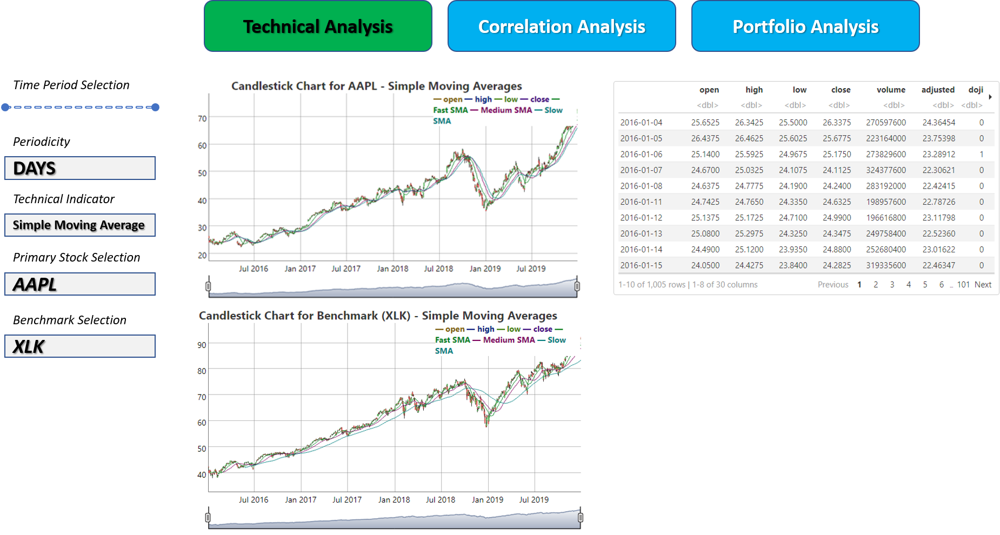
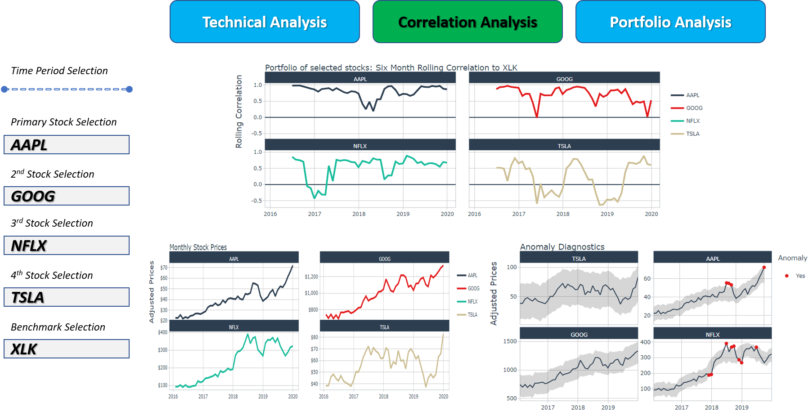
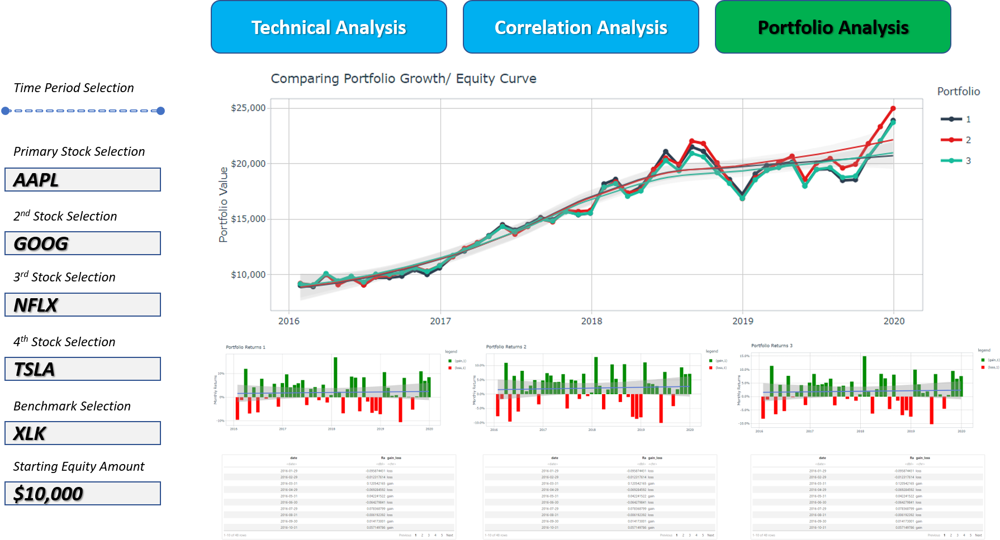
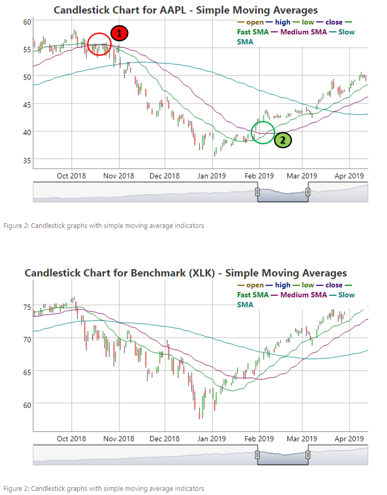
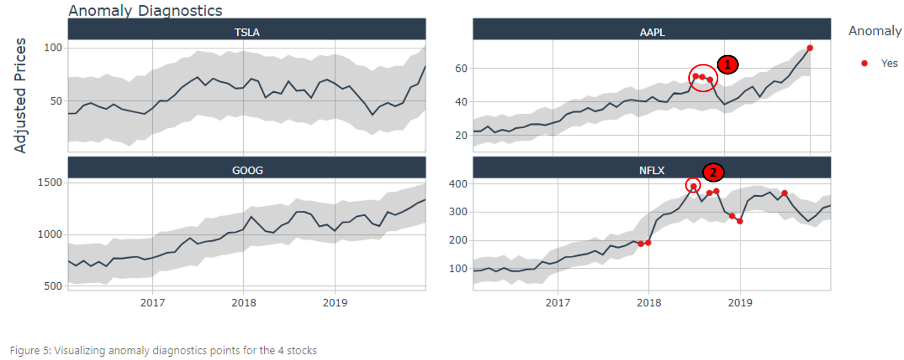
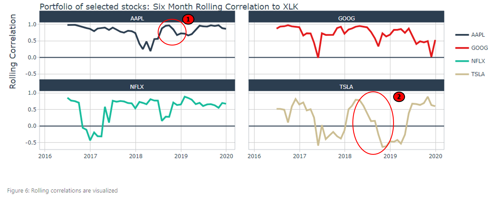
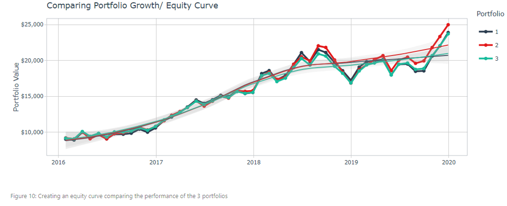

```{r setup, include=FALSE}
knitr::opts_chunk$set(echo = FALSE)
```

## 1. Overview

### 1.1 Background

Traditional financial data websites usually shy away from giving recommendations or advising users on investing decisions. While in depth studies are often conducted and used in academia or research, the outputs of these studies are often not accessible nor timely enough for the regular user. This means that these websites and their applications are limited in their use-cases. This can be due to issues arising from financial or legal liability if users act on the recommendations coming from these financial websites. As such we feel that this a gap between what is available publicly and user requirements. 

### 1.2 Literature review, Objective/ Motivation 

In the literature review conducted, it was found that there have been various attempts by users to provide tools for analysing stock price action. Existing charting or dashboarding tools often focus on only simple charting or technical indicator functionalities. Most open source/ free tools *only offer the various functionalities in isolation*, and users are *unable to have a holistic view* uniting technical analysis, portfolio analysis, and the other components to allow for complete decision making when *making buying and selling decisions.*

In the final product, the team will put together various sub-modules spanning across:  **Charting, Technical Analysis, Correlation Analysis**, Clustering, Forecasting, **Portfolio Analysis.**

The motivation of building this sub-module is to focus on those mentioned in bold above.

This sub-module aims to provide rookie investors with tools to observe: a) The price action of various securities, b) Correlation of chosen stocks vs an underlying benchmark, and c) Portfolio performance over time.

The subsequent sections are mainly split into the following features:

- Charting and technical analysis
- Correlation analysis between selected portfolio of stocks vs a benchmark index
- Portfolio analysis:
  - Individual portfolio returns
  - Equity curve/ portfolio growth over time


**Jump straight to the proposed visualizations and layout: [3. Proposed Visualization](#anchor)**


### 1.3 Charting and Technical Analysis

In this module, users are able to visualize the chosen stock symbol using a candlestick chart. Open, High, Low, and Close prices for the selected period are shown on the chart.

In addition, users are able to choose between 2 sets of technical indicators: Simple moving averages and Bollinger Bands. Users are able to see the chosen symbol on 1 chart, and the accompanying benchmark index chosen on another chart. Both charts are created in an interactive manner using the plotly package.

Finally, multiple features based on candlestick patterns are created and available through a table. Such candlestick patterns inform users of certain bullish or bearish price action patterns observed. This provides a different perspectives to users incline towards technical analysis.


### 1.4 Correlation Analysis

In this module, users are able to:

- Choose 4 stock symbols and visualize their monthly adjusted prices
- Visualize any anomalous points for these 4 stock symbols using an interactive chart
- Visualize the 6 month rolling correlation between the 4 stock symbols, and the accompanying benchmark index


### 1.5 Portfolio Analysis

In this module, users are able to:

- Create 3 portfolios with different weightages for the 4 chosen stock symbols plus the accompanying benchmark index
- Visualize the monthly returns (in %) for the 3 different portfolios on an interactive plot
- Visualize an equity curve of the 3 portfolios, where users are able to choose the starting equity amount


## 2. Building the Visualization

### 2.1 Setting up the environment/ packages

First, we run this first line of code to clear the environment and remove existing R objects (if any)

```{r, echo=TRUE, eval=TRUE, fig.cap="Starting on a clean slate"}

rm(list=ls())

```

This code chunk checks if required packages are installed. If they are not installed, the next line of code will install them. The following line is then use to import the library into the current working environment.

```{r, echo=TRUE, eval=TRUE, fig.cap="Installing and importing libraries"}

packages = c('tidyverse','tidyquant','dygraphs','plotly','ggplot2','timetk', 'rmarkdown','knitr')
for (p in packages) {
  if(!require(p,character.only = T)){
    install.packages(p)
  }
  library(p,character.only = T)
}

```

### 2.2 Charting and Technical Analysis

Users will be able to specify the start and end dates for the period under analysis. In addition, they are able to specify the periodicity (e.g. days, weeks, months, years).

```{r, echo=TRUE, eval=TRUE, fig.cap="Setting the start and end dates of the period under analysis"}
from_date <- "2016-01-01"
to_date <- "2019-12-31"
period_type <- "days"
# "days"/ "weeks"/ "months"/ "years"
```

*The application will use open source and live data obtained through the [**tidyquant**](https://cran.r-project.org/web/packages/tidyquant/index.html) package.* 

Users are able to select the individual stock symbol and benchmark index of their choice. The following code chunk utilizes the tidyquant package to extract stock data from Yahoo Finance. Depending on the period_type specified by users before, the periodicity can be changed.

```{r, echo=TRUE, eval=TRUE, fig.cap="Extracting stock data based on user input symbols"}
ticker_selected <- "AAPL" 

ticker_data_daily <- tq_get(ticker_selected,
               get = "stock.prices",
               from = from_date,
               to = to_date) %>%
            tq_transmute(select     = NULL, 
                 mutate_fun = to.period, 
                 period     = period_type)
paged_table(ticker_data_daily) 

# Benchmark Index
benchmark_selected <- "XLK"

benchmark_data_daily <- tq_get(benchmark_selected,
               get = "stock.prices",
               from = from_date,
               to = to_date) %>%
              tq_transmute(select     = NULL, 
                 mutate_fun = to.period, 
                 period     = period_type)
paged_table(benchmark_data_daily)
```

The following code chunk creates a clean candlestick chart without indicators for the selected stock ticker and benchmark index. To use the dygraphs package, the input data has to be transformed from tibble to xts (extensible time series) format. We use the tk_xts() function from the timetk package for this.

For charting, we use the dygraph package. We specify dyCandlestick() to create a candlestick chart, and dyRangeSelector() to allow users to have the ability to toggle the range on the charts. In addition, specifying the group = "charting" argument allows for synchronization between charts sharing the same argument value. Changes made to either affects both charts interactively.

```{r, echo=TRUE, eval=TRUE, results='hide', message=FALSE}
ticker_data_daily_xts <- tk_xts(
  ticker_data_daily %>%  select(date, open,high,low,close) )

benchmark_data_daily_xts <- tk_xts(
  benchmark_data_daily %>%  select(date, open,high,low,close) )

ticker_data_daily_xts %>%
  dygraph(main = "Candlestick Chart for AAPL", group = "charting") %>% 
    dyCandlestick() %>%
    dyRangeSelector() %>% 
    dyCrosshair(direction = "vertical")

benchmark_data_daily_xts %>%
  dygraph(main = "Candlestick Chart for Benchmark Index (XLK)", group = "charting") %>% 
    dyCandlestick() %>% 
    dyRangeSelector() %>% 
    dyCrosshair(direction = "vertical")
```

```{r, echo=FALSE, eval=TRUE, out.width="100%", fig.cap="Normal graphs without indicators"}
ticker_data_daily_xts %>%
  dygraph(main = "Candlestick Chart for AAPL", group = "charting") %>% 
    dyCandlestick() %>%
    dyRangeSelector() %>% 
    dyCrosshair(direction = "vertical")

benchmark_data_daily_xts %>%
  dygraph(main = "Candlestick Chart for Benchmark Index (XLK)", group = "charting") %>% 
    dyCandlestick() %>% 
    dyRangeSelector() %>% 
    dyCrosshair(direction = "vertical")
```

The following code chunk creates a similar candlestick chart, this time with the simple moving averages technical indicator.

```{r, echo=TRUE, eval=TRUE, results='hide', message=FALSE}
# 20-day SMA
sma_fast <- SMA(ticker_data_daily_xts$close, n=20)
# 40-day SMA
sma_med <- SMA(ticker_data_daily_xts$close, n=40)
# 100-day SMA
sma_slow <- SMA(ticker_data_daily_xts$close, n=100)

ticker_data_daily_xts_sma <- data.frame(ticker_data_daily_xts, sma_fast, sma_med, sma_slow)

# head(ticker_data_daily_xts_sma)

chart_sma <- cbind(ticker_data_daily_xts_sma[,1:4], ticker_data_daily_xts_sma[,5], ticker_data_daily_xts_sma[,6], ticker_data_daily_xts_sma[,7])
colnames(chart_sma)[5]  <- "Fast SMA"
colnames(chart_sma)[6]  <- "Medium SMA"
colnames(chart_sma)[7]  <- "Slow SMA"

# 20-day SMA
sma_fast_bm <- SMA(benchmark_data_daily_xts$close, n=20)
# 40-day SMA
sma_med_bm <- SMA(benchmark_data_daily_xts$close, n=40)
# 100-day SMA
sma_slow_bm <- SMA(benchmark_data_daily_xts$close, n=100)

benchmark_data_daily_xts_sma <- data.frame(benchmark_data_daily_xts, sma_fast_bm, sma_med_bm, sma_slow_bm)

# head(benchmark_data_daily_xts_sma)

chart_sma_bm <- cbind(benchmark_data_daily_xts_sma[,1:4], benchmark_data_daily_xts_sma[,5], benchmark_data_daily_xts_sma[,6], benchmark_data_daily_xts_sma[,7])
colnames(chart_sma_bm)[5]  <- "Fast SMA"
colnames(chart_sma_bm)[6]  <- "Medium SMA"
colnames(chart_sma_bm)[7]  <- "Slow SMA"


chart_sma %>%
  dygraph(main = "Candlestick Chart for AAPL - Simple Moving Averages", group = "chart_sma") %>% 
    dyCandlestick() %>% 
    dyRangeSelector() %>% 
    dyCrosshair(direction = "vertical")

chart_sma_bm %>%
  dygraph(main = "Candlestick Chart for Benchmark (XLK) - Simple Moving Averages", group = "chart_sma") %>% 
    dyCandlestick() %>% 
    dyRangeSelector() %>% 
    dyCrosshair(direction = "vertical")
```

```{r, echo=FALSE, eval=TRUE, out.width="100%", fig.cap="Candlestick graphs with simple moving average indicators"}
chart_sma %>%
  dygraph(main = "Candlestick Chart for AAPL - Simple Moving Averages", group = "chart_sma") %>% 
    dyCandlestick() %>% 
    dyRangeSelector() %>% 
    dyCrosshair(direction = "vertical")

chart_sma_bm %>%
  dygraph(main = "Candlestick Chart for Benchmark (XLK) - Simple Moving Averages", group = "chart_sma") %>% 
    dyCandlestick() %>% 
    dyRangeSelector() %>% 
    dyCrosshair(direction = "vertical")
```

The following code chunk creates a similar candlestick chart, this time with the Bollinger Bands technical indicator.

```{r, echo=TRUE, eval=TRUE, results='hide', message=FALSE}
bb20 <- BBands(ticker_data_daily_xts$close, sd=2.0, n=14, maType=EMA)

ticker_data_daily_xts_bb <- data.frame(ticker_data_daily_xts, bb20)

chart_bband <- cbind(ticker_data_daily_xts_bb[,1:4], ticker_data_daily_xts_bb[,5], ticker_data_daily_xts_bb[,6], ticker_data_daily_xts_bb[,7])
colnames(chart_bband)[5]  <- "Lower Band"
colnames(chart_bband)[6]  <- "Moving Average"
colnames(chart_bband)[7]  <- "Upper Band"

bb20_bm <- BBands(benchmark_data_daily_xts$close, sd=2.0, n=14, maType=EMA)


benchmark_data_daily_xts_bb <- data.frame(benchmark_data_daily_xts, bb20_bm)

chart_bband_bm <- cbind(benchmark_data_daily_xts_bb[,1:4], benchmark_data_daily_xts_bb[,5], benchmark_data_daily_xts_bb[,6], benchmark_data_daily_xts_bb[,7])
colnames(chart_bband_bm)[5]  <- "Lower Band"
colnames(chart_bband_bm)[6]  <- "Moving Average"
colnames(chart_bband_bm)[7]  <- "Upper Band"


chart_bband %>%
  dygraph(main = "Candlestick Chart for AAPL - Bollinger Bands", group = "chart_bband") %>% 
    dyCandlestick() %>% 
    dyRangeSelector() %>% 
    dyCrosshair(direction = "vertical")

chart_bband_bm %>%
  dygraph(main = "Candlestick Chart for Benchmark (XLK) - Bollinger Bands", group = "chart_bband") %>% 
    dyCandlestick() %>% 
    dyRangeSelector() %>% 
    dyCrosshair(direction = "vertical")

```

```{r, echo=FALSE, eval=TRUE, out.width="100%", fig.cap="Candlestick graphs with bollinger bands indicators"}
chart_bband %>%
  dygraph(main = "Candlestick Chart for AAPL - Bollinger Bands", group = "chart_bband") %>% 
    dyCandlestick() %>% 
    dyRangeSelector() %>% 
    dyCrosshair(direction = "vertical")

chart_bband_bm %>%
  dygraph(main = "Candlestick Chart for Benchmark (XLK) - Bollinger Bands", group = "chart_bband") %>% 
    dyCandlestick() %>% 
    dyRangeSelector() %>% 
    dyCrosshair(direction = "vertical")
```

When analysing candlestick charts, there are various patterns observable to those interested in technical analysis. Such patterns may inform a user if there is a bullish or a bearish short term trend observed. We are able to utilize the "CandleStickPattern" package developed by Ko Chiu Yu to create various extra features representing such candlestick patterns.

The following code chunk creates features for multiple candlestick patterns covered in the package. In each column, a value of 1 represents the presence of such a pattern in that current candlestick, while a 0 indicates the absence of such a pattern.

In addition, the final column "bull_bear_strength" represents a summation of all available candlestick pattern indicators. It ranges from -2 (extremely bearish) to 2 (extremely bullish), with 0 being neutral/ indecisiveness in the price action.

It may be useful to introduce such features into the final Shiny app. These features provides a different perspective for users inclined towards technical analysis for stocks, apart from the usual indicators such as moving averages or bollinger bands.

```{r, echo=TRUE, eval=TRUE, out.width="100%", fig.cap="Candlestick graphs with bollinger bands indicators"}

# install_github("kochiuyu/CandleStickPattern")

library(CandleStickPattern)

price <- tk_xts(ticker_data_daily)

# INDECISIVE candlestick pattern
price$doji <- doji(price)

# BULLISH candlestick patterns
price$dragonfly_doji <- dragonfly.doji(price)
price$hammer <- hammer(price)
price$bullish_engulf <- bullish.engulf(price)
price$bullish_harami <- bullish.harami(price)
price$kick_up <- kick.up(price)
price$three_white_soldiers <- three.white.soldiers(price)
price$morning_star <- morning.star(price)
price$rising_three <- rising.three(price)

price$piercing_line <- piercing.line(price)
price$dark_cloud_cover <- dark.cloud.cover(price)

# BEARISH candlestick patterns
price$gravestone_doji <- gravestone.doji(price)
price$inverted_hammer <- inverted.hammer(price)
price$bearish_engulf <- bearish.engulf(price)
price$bearish_harami <- bearish.harami(price)
price$kick_down <- kick.down(price)
price$three_black_crows <- three.black.crows(price)
price$evening_star <- evening.star(price)
price$falling_three <- falling.three(price)

price$total_bull_score <- rowSums(price[, c("dragonfly_doji", "hammer", "bullish_engulf", "bullish_harami", "kick_up", "three_white_soldiers",
                                            "morning_star", "morning_star", "piercing_line", "dark_cloud_cover")])

price$total_bear_score <- rowSums(price[, c("gravestone_doji", "inverted_hammer", "bearish_engulf", "bearish_harami", "kick_down", "three_black_crows",
                                            "evening_star", "falling_three")]) * -1

price$total_bull_bear_score <- price$total_bull_score + price$total_bear_score

price[is.na(price)] <- 0

# Use recoding to create bull_bear_strength here from -2 (very bearish sentiment) to 2 (very bullish sentiment).
price$bull_bear_strength[price$doji == 1 | price$total_bull_bear_score == 0] <- 0
price$bull_bear_strength[price$total_bull_bear_score > 2] <- 2
price$bull_bear_strength[price$total_bull_bear_score <= 2 & price$total_bull_bear_score > 0] <- 1
price$bull_bear_strength[price$total_bull_bear_score < -2] <- -2
price$bull_bear_strength[price$total_bull_bear_score >= -2 & price$total_bull_bear_score < 0] <- -1

price <- data.frame(price)
paged_table(price)
```


### 2.3 Correlation Analysis

Similar to the previous module, users will be able to specify the start and end dates for the period under analysis.

```{r, echo=TRUE, eval=TRUE, fig.cap="Setting the start and end dates of the period under analysis"}
from_date <- "2016-01-01"
to_date <- "2019-12-31"
```

In the following code chunk, users select 4 stock symbols to form a portfolio, and an accompanying underlying benchmark index symbol. Data extracted is based on adjusted prices. For the purposes of measuring returns, a monthly periodicity is selected to avoid noise in the short term (e.g. daily).

```{r, echo=TRUE, eval=TRUE, out.width="100%", fig.cap="Extracting data for a selected portfolio of stocks"}
port_corr_ticker_selection <- c("TSLA", "AAPL", "GOOG", "NFLX")
port_corr_benchmark_ticker <- "XLK"

PORT_mth <- port_corr_ticker_selection %>%
    tq_get(get  = "stock.prices",
           from = from_date,
           to   = to_date) %>%
    group_by(symbol) %>%
    tq_transmute(select     = adjusted, 
                 mutate_fun = to.period, 
                 period     = "months")
paged_table(PORT_mth)

```

In the following code chunk, users are able to visualize the monthly stock prices for the 4 chosen stocks in a facet wrap for convenience. The plots are made interactive using the plotly package.

```{r, layout = 'l-page', echo=TRUE, eval=TRUE, out.width="100%", fig.cap="Visualizing monthly stock prices for the portfolio of stocks"}

port_mth_plotly <- PORT_mth %>%
        ggplot(aes(x = date, y = adjusted, color = symbol)) +
        geom_line(size = 1) +
        labs(title = "Monthly Stock Prices",
             x = "", y = "", color = "") +
        facet_wrap(~ symbol, ncol = 2, scales = "free_y") +
        scale_y_continuous(labels = scales::dollar) +
        theme_tq() + 
        scale_color_tq()
port_mth_plotly <- ggplotly(port_mth_plotly) %>% 
        layout(yaxis = list(title = list(text = "Adjusted Prices", standoff = 20L)))
port_mth_plotly

```

In the following code chunk, users are able to visualize anomalous points in the monthly stock prices for the 4 chosen stocks in a facet wrap for convenience. The plots are made interactive using the plotly package. While stocks in general may exhibit a volatile nature, such anomalous points in time may provide some indication of a turning point where stocks have been overbought or oversold in the short term.

```{r, layout = 'l-page', echo=TRUE, eval=TRUE, out.width="100%", fig.cap="Visualizing anomaly diagnostics points for the 4 stocks"}

PORT_mth %>%
    group_by(symbol) %>%
    plot_anomaly_diagnostics(date, adjusted, .facet_ncol = 2) %>% 
    layout(yaxis = list(title = list(text = "Adjusted Prices", standoff = 20L)))

```

In the following code chunk, the monthly returns are calculated for both the selected portfolio stocks and the accompanying benchmark index.

```{r, echo=TRUE, eval=TRUE, out.width="100%", fig.cap="Calculating monthly returns for portfolio stocks and benchmark index"}

PORT_returns_monthly <- port_corr_ticker_selection %>%
    tq_get(get  = "stock.prices",
           from = from_date,
           to   = to_date) %>%
    group_by(symbol) %>%
    tq_transmute(select     = adjusted, 
                 mutate_fun = periodReturn, 
                 period     = "monthly")

paged_table(PORT_returns_monthly)

# Baseline Returns
baseline_returns_monthly <- port_corr_benchmark_ticker %>%
    tq_get(get  = "stock.prices",
           from = from_date,
           to   = to_date) %>%
    tq_transmute(select     = adjusted, 
                 mutate_fun = periodReturn,
                 period     = "monthly")
paged_table(baseline_returns_monthly)

```

In the following code chunk, a left join is performed to combine the monthly returns of the portfolio and the benchmark index returns.

```{r, echo=TRUE, eval=TRUE, out.width="100%", fig.cap="Performing a left join to bring in the baseline benchmark returns"}

returns_joined <- left_join(PORT_returns_monthly, 
                            baseline_returns_monthly,
                            by = "date")
paged_table(returns_joined)

```

In the following code chunk, the runCor function is used to evaluate the rolling correlations using the xy pattern.

```{r, echo=TRUE, eval=TRUE, out.width="100%", fig.cap="Rolling correlations between portfolio stocks and benchmark is calculated"}

PORT_rolling_corr <- returns_joined %>%
    tq_transmute_xy(x          = monthly.returns.x, 
                    y          = monthly.returns.y,
                    mutate_fun = runCor,
                    n          = 6,
                    col_rename = "rolling.corr.6")
paged_table(PORT_rolling_corr)
```

In the following code chunk, the rolling correlations previously calculated are now visualized using plotly.

```{r, layout = 'l-page', echo=TRUE, eval=TRUE, out.width="100%", fig.cap="Rolling correlations are visualized"}

port_rolling_corr_plotly <- PORT_rolling_corr %>%
        ggplot(aes(x = date, y = rolling.corr.6, color = symbol)) +
        geom_hline(yintercept = 0, color = palette_light()[[1]]) +
        geom_line(size = 1) +
        labs(title = "Portfolio of selected stocks: Six Month Rolling Correlation to XLK",
             x = "", y = "", color = "") +
        facet_wrap(~ symbol, ncol = 2) +
        theme_tq() + 
        scale_color_tq()

port_rolling_corr_plotly <- ggplotly(port_rolling_corr_plotly) %>% 
        layout(yaxis = list(title = list(text = "Rolling Correlation", standoff = 20L)))
port_rolling_corr_plotly
```

### 2.4 Portfolio Analysis

Similar to the previous module, users will be able to specify the start and end dates for the period under analysis. In addition, they specify which the stock symbols for 4 stocks + 1 benchmark index. These stocks symbols will be used to form the portfolio for further analysis.

```{r, echo=TRUE, eval=TRUE, out.width="100%", fig.cap="Setting the start and end dates, selecting stock symbols"}
from_date <- "2016-01-01"
to_date <- "2019-12-31"
portfolio_ticker_selection <- c("AAPL", "GOOG", "NFLX", "TSLA", "XLK")
benchmark_ticker_selection <- "XLK"
initial_investment_capital <- 10000
```

In the following code chunk, we calculate the monthly returns for the selected stock symbols.

```{r, echo=TRUE, eval=TRUE, out.width="100%", fig.cap="Calculating monthly returns for the selected stock symbols"}
stock_returns_monthly <- portfolio_ticker_selection %>%
    tq_get(get  = "stock.prices",
           from = from_date,
           to   = to_date) %>%
    group_by(symbol) %>%
    tq_transmute(select     = adjusted, 
                 mutate_fun = periodReturn, 
                 period     = "monthly", 
                 col_rename = "Ra")
paged_table(stock_returns_monthly)
```

In the following code chunk, we specify the weights of portfolio 1, and visualize the monthly returns using plotly. We create a new field called gain_loss, where gains are visualized as green, while losses are visualized as red. 

We further add a smoothing line (in blue) as an additional layer onto our graph. This allows us to quickly see a general trend of the portfolio across the period. 

```{r, layout = 'l-page', echo=TRUE, eval=TRUE, out.width="100%", fig.cap="Visualization the monthly returns of Portfolio 1"}
wts_1 <- c(0.25, 0.25, 0.25, 0.25, 0.00)
portfolio_returns_monthly_1 <- stock_returns_monthly %>%
    tq_portfolio(assets_col  = symbol, 
                 returns_col = Ra, 
                 weights     = wts_1, 
                 col_rename  = "Ra") %>% 
    mutate(gain_loss = if_else(Ra > 0, "gain", "loss"))

paged_table(portfolio_returns_monthly_1)

port_returns_1_plotly <- portfolio_returns_monthly_1 %>%
    ggplot(aes(x = date, y = Ra)) +
    geom_bar(stat = "identity", aes(fill = gain_loss)) +
    scale_fill_manual("legend", values = c("gain" = "green4", "loss" = "red")) +
    labs(title = "Portfolio Returns 1",
         x = "", y = "Monthly Returns") +
    geom_smooth(method = "lm") +
    theme_tq() +
    scale_color_tq() +
    scale_y_continuous(labels = scales::percent)

port_returns_1_plotly <- ggplotly(port_returns_1_plotly)
port_returns_1_plotly

```

Similarly, we specify weights for the 2nd portfolio and do create a visualization in the same style.

Weights used are as follows: "wts_2 <- c(0.40, 0.30, 0.20, 0.10, 0.00)".

```{r, layout = 'l-page', echo=FALSE, eval=TRUE, out.width="100%", fig.cap="Visualization the monthly returns of Portfolio 2"}
wts_2 <- c(0.40, 0.30, 0.20, 0.10, 0.00)
portfolio_returns_monthly_2 <- stock_returns_monthly %>%
    tq_portfolio(assets_col  = symbol, 
                 returns_col = Ra, 
                 weights     = wts_2, 
                 col_rename  = "Ra") %>% 
    mutate(gain_loss = if_else(Ra > 0, "gain", "loss"))

port_returns_2_plotly <- portfolio_returns_monthly_2 %>%
    ggplot(aes(x = date, y = Ra)) +
    geom_bar(stat = "identity", aes(fill = gain_loss)) +
    scale_fill_manual("legend", values = c("gain" = "green4", "loss" = "red")) +
    labs(title = "Portfolio Returns 2",
         x = "", y = "Monthly Returns") +
    geom_smooth(method = "lm") +
    theme_tq() +
    scale_color_tq() +
    scale_y_continuous(labels = scales::percent)
port_returns_2_plotly <- ggplotly(port_returns_2_plotly)
port_returns_2_plotly

```

Similarly, we specify weights for the 3rd portfolio and do create a visualization in the same style.

Weights used are as follows: "wts_3 <- c(0.20, 0.20, 0.20, 0.20, 0.20)".

```{r, layout = 'l-page', echo=FALSE, eval=TRUE, out.width="100%", fig.cap="Visualization the monthly returns of Portfolio 3"}
wts_3 <- c(0.20, 0.20, 0.20, 0.20, 0.20)
portfolio_returns_monthly_3 <- stock_returns_monthly %>%
    tq_portfolio(assets_col  = symbol, 
                 returns_col = Ra, 
                 weights     = wts_3, 
                 col_rename  = "Ra")%>% 
    mutate(gain_loss = if_else(Ra > 0, "gain", "loss"))

port_returns_3_plotly <- portfolio_returns_monthly_3 %>%
    ggplot(aes(x = date, y = Ra)) +
    geom_bar(stat = "identity", aes(fill = gain_loss)) +
    scale_fill_manual("legend", values = c("gain" = "green4", "loss" = "red")) +
    labs(title = "Portfolio Returns 3",
         x = "", y = "Monthly Returns") +
    geom_smooth(method = "lm") +
    theme_tq() +
    scale_color_tq() +
    scale_y_continuous(labels = scales::percent)
port_returns_3_plotly <- ggplotly(port_returns_3_plotly)
port_returns_3_plotly

```


In the following code chunk, we create a weights table. Here, we create 3 sets of weights for the selected 5 symbols (4 stocks + 1 benchmark index).

When designing the shiny app, users will be able to set the various weights for the 3 different portfolios.

```{r, echo=TRUE, eval=TRUE, out.width="100%", fig.cap="Creating a weights table"}
weights <- c(
    0.25, 0.25, 0.25, 0.25, 0.00,
    0.40, 0.30, 0.20, 0.10, 0.00, 
    0.20, 0.20, 0.20, 0.20, 0.20
)

weights_table <-  tibble(portfolio_ticker_selection) %>%
    tq_repeat_df(n = 3) %>%
    bind_cols(tibble(weights)) %>%
    group_by(portfolio)
paged_table(weights_table)
```

In the following code chunk, we scale the single portfolio to 3, for subsequent multiple portfolio comparison analysis.

```{r, echo=TRUE, eval=TRUE, out.width="100%", fig.cap="Scaling a single portfolio to 3"}
stock_returns_monthly_multi <- stock_returns_monthly %>%
    tq_repeat_df(n = 3)
paged_table(stock_returns_monthly_multi)
```

In the following code chunk, we apply the weights table to the previously calculated monthly returns of the 3 portfolios. In addition, the initial investment capital is used along with the monthly returns to create the portfolio equity position every month.

```{r, echo=TRUE, eval=TRUE, out.width="100%", fig.cap="Applying the weights table to calculate the various portfolios' monthly returns"}
portfolio_growth_monthly_multi <- stock_returns_monthly_multi %>%
    tq_portfolio(assets_col   = symbol, 
                 returns_col  = Ra, 
                 weights      = weights_table, 
                 col_rename   = "investment.growth",
                 wealth.index = TRUE) %>%
    mutate(investment.growth = investment.growth * initial_investment_capital)
paged_table(portfolio_growth_monthly_multi)
```

In the following code chunk, we create an equity curve comparing the performance of the 3 portfolios created.

```{r, layout = 'l-page', echo=TRUE, eval=TRUE, out.width="100%", fig.cap="Creating an equity curve comparing the performance of the 3 portfolios"}
portfolio_plotly <- portfolio_growth_monthly_multi %>%
    ggplot(aes(x = date, y = investment.growth, color = factor(portfolio))) +
    geom_line(size = 1) + geom_point() +
    labs(title = "Comparing Portfolio Growth/ Equity Curve",
         x = "", y = "Portfolio Value",
         color = "Portfolio") +
    geom_smooth(method = "loess", alpha = 0.1, size = 0.5) +
    theme_tq() +
    scale_color_tq() +
    scale_y_continuous(labels = scales::dollar)
portfolio_plotly <- ggplotly(portfolio_plotly)
portfolio_plotly
```

## 3. Proposed Visualization {#anchor}

There are 3 main tabs:

1. Charting and Technical Analysis
2. Correlation Analysis
3. Portfolio Analysis

```{r, layout = 'l-page', fig.align="center",echo=FALSE, out.width="100%", fig.cap="Sketch of Tab 1 - Charting and Technical Analysis"}

```

Under the **Technical Analysis tab**, users are able to:

* View and interact with candlestick charts (both charts are grouped and affect each other in real time)
* Choose between Simple Moving Average or Bollinger Bands indicators overlay
* Select the primary and benchmark stock symbol
* Select the time period for analysis
* View the raw data in a table, along with other candlestick pattern features created

```{r, layout = 'l-page', fig.align="center",echo=FALSE, out.width="100%", fig.cap="Sketch of Tab 2 - Correlation Analysis"}

```

Under the **Correlation Analysis tab**, users are able to:

* View and interact with candlestick charts
* Select the time period for analysis
* Select 4 stocks, and 1 benchmark stock symbol

```{r, layout = 'l-page', fig.align="center",echo=FALSE, out.width="100%", fig.cap="Sketch of Tab 3 * Portfolio Analysis"}

```

Under the **Portfolio Analysis tab**, users are able to:

* View and interact with candlestick charts
* Select the time period for analysis
* Select 4 stocks, and 1 benchmark stock symbol
* Select a starting equity amount

## 4. Insights

**The various functionalities designed allow for a user to explore, choose, and optimize for a portfolio of stocks suited to their preferences.**

**Insight 1**

```{r, fig.align="center",echo=FALSE, out.width="100%", fig.cap="Example of Technical Analysis using Simple Moving Averages"}

```

**Simple Moving Averages are a common but effective technical indicator used by many people.** These moving averages essentially defer from each other based on the number of periods of lookback.

A short term moving average is typically interpreted as short term price trends largely influenced by activities of traders.

A longer term moving average is typically interpreted as a major change in trend that is influenced also by investors with a longer time horizon.

In general, when the moving average lines are sloping up, it denotes a bullish trend with prices rising. The converse, with moving average lines sloping down denotes a bearish trend.

In addition, the combination of multiple Simple Moving Averages provides users with another way to identify specify entry or exit points.

Looking at the AAPL candlestick chart for period (1), we see that in mid-Oct 2018 before the large market selldown, the short term moving average line (fast line) had **crossed below** the medium term moving average line. This indicates a potential bearish trend. Prices continued to fall all the way to a low in Jan 2019.

On the other hand, looking at the AAPL candlestick chart for period (2), we see that as prices started to pick up, the resumption of a bullish trend was picked up by the fast moving average **crossing back above** the medium moving average. Prices continued to rise further after that period.

*The inclusion of Simple Moving Averages as a technical indicator on candlestick charts can be a useful addition to users performing technical analysis on stocks.*

**Insight 2**

```{r, layout = 'l-page', fig.align="center",echo=FALSE, out.width="100%", fig.cap="Example of using Anomaly Detection to recognize potential turning points in a securities' time series behaviour "}

```

The inclusion of a chart visualizing anomaly diagnostics available from the timetk package easily provides visual cues to users on unusual points (anomalies) on time series data. Such anomalous points may be indicative of a potential turning point in the trend of the stock price.

As shown in both (1) and (2) on the chart, such points may inform a user that the bullish trend has come to an end, and a reversal is taking place.

Users may take note of such an indicator (along with considering many other factors) in assessing whether to exit a position, continue to do nothing and observe, or to even short-sell the stock.

**Insight 3**

```{r, layout = 'l-page',fig.align="center",echo=FALSE, out.width="100%", fig.cap="6 month rolling correlation between chosen stocks and underlying benchmark index"}

```

Correlation analysis between chosen stocks and an underlying index may help to guide a user's choices in selecting either a concentrated or diversified portfolio (depending on their investing preference).

In this example, when looking at the broader market pullback in end of 2018, we see in (1), that AAPL stock was still quite highly correlated with the technology sector ETF (*XLK*). This is to be expected as AAPL is considered as a technology stock.

On the other hand, during the same period seen in (2), we see that Tesla had a negative correlation with XLK. This indicates that prices move in different directions from the underlying benchmark index.

Investors can utilize such insights to choose and update their portfolio of stocks to either be largely concentrated in that sector (look for stocks that are consistently highly correlated with the sector), or to be more diversified (look for stocks that consistently have low correlation with the sector).


**Insight 4**

```{r, layout = 'l-page', fig.align="center",echo=FALSE, out.width="100%", fig.cap="Analysing the Equity Curves/ Performance of multiple portfolios"}

```

Portfolio analysis allows users to compare the performance of various portfolios (*constructed using different weights*) across time.

Users are able to specify a starting equity amount, and visualize the equity curve over time.

Users can tweak the weightage of the various stocks in the portfolio to achieve an equity curve that exhibits strong growth, but yet tolerable periods of drawdown (periods when the portfolio performance exhibits a downwards trend from most recent highs).


## 5. References

* https://business-science.github.io/tidyquant/
* https://www.business-science.io/code-tools/2020/09/02/five-minute-time-series-anomaly-detection.html
* https://business-science.github.io/timetk/articles/TK00_Time_Series_Coercion.html
* https://bookdown.org/kochiuyu/Technical-Analysis-with-R/


